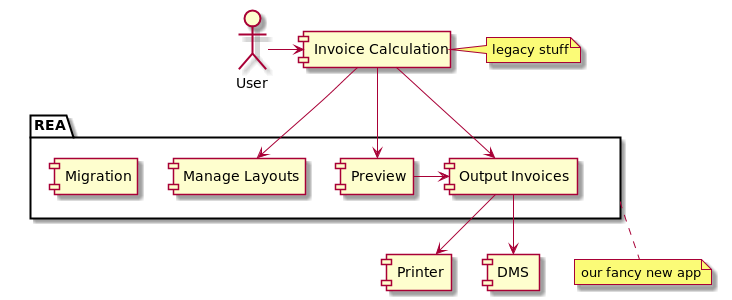

# 4 years of TDD

## the good, the bad, the ugly

@ChristophWelcz

https://github.com/enolive/why-tdd


## Warning

Some aspects might be obvious...


Source: [knowyourmeme.com](http://knowyourmeme.com/photos/1005018-captain-obvious)


## whoami.json

```json
{
  "name": "Christoph Welcz",
  "birthDate": "23.06.1978",
  "company": {
    "name": "DATEV e.G.",
    "since": "2005",
    "tdd-since": "2013"
  },
  "professions": [
    "Software Craftsman",
    "Master of Sloth & Incompentence"
  ],
  "interests": [
    "Software Craftsmanship",
    "Clean Code",
    "TDD",
    "Continuous Refactoring"
  ],
  "contact": {
    "git": "https://github.com/enolive",
    "twitter": "@ChristophWelcz",
    "mail": [
      "christoph@welcz.de",
      "christoph.welcz@datev.de"
      ]
  }
}
```


## why we chose TDD

Contributing factors

* high degree of autonomy
* beginning Agile Transition
* SCC @ DATEV


### most important

* colleague, with sparkling eyes: "I learned something really cool at my last course, let us try it"
* me, being fed up with doing a poor job: "sure"


## our context

* rewrite of an invoice output app
    * VB6 -> C#/.NET
* Customizable Layouts
    * Proprietary format -> XML
    



### where we started...

* 3 developers
* many dependencies
* incomplete documentation of old app
* little to no experience with TDD


### ...where we are now

* ~100k LoC
* ~ 87% code coverage
* 3:2 ratio test/production code
* over 6000 unit tests
* 200 integration tests
* 70 acceptance tests with SpecFlow
* 50 UI Tests


# The Good

What TDD helped us with


## TDD makes you faster

* More effort to write code (30%)
* When feature is finished, it just works
* Less bugs (50%)
* Less debugging (90%)
* Bugfixing much easier through reproduction tests!

I am constantly overestimating my tasks by 50%


## TDD is much faster than Test last

* I need about 3x as long when writing tests after
* I almost always find at least one bug ;-)


## TDD is fun

writing a complex features for weeks without seeing it working sucks :(

* small feedback cycles
* feeling of accomplishment after each Red-Green-Refactor step


## Refactoring less scary

* Tests as a security net
* Code is cleaner
* Small number of code smells


### Big refactorings totally feasible

* 3~4 big refactorings
    * total rewrite of the migration result storage
    * partial rewrite of the migration wizard
    * 3 iterations for scheduling our output steps


## Involving more people is easier

* 10 additional devs for short time tasks
* 3 of them were absolute newbies


### Less bottlenecks

* 4 devs were programming different parts of the same feature
* integration at the end (3 weeks) trivial


## Extending scope is easy

Added new unplanned features

* Machine understandable Digital invoices
* Output via Mail (SMTP, MAPI)
* Upload to a in-house cloud service
* Customizable Mail Templates with WYSIWYG editor


## LoC nearly constant for 2.5 years

* Removing deprecated code possible
* Less maintenance


## Learning new techniques...

* FP
* Serialization
* Extension methods
* Programming with Promises


### ...and new APIs

* Can be tried out in new integration tests first
* Problems become rapidly eminent (bugs, wrong usage)

Learning tests have a negative effort!


# The Bad

our main problems and how we encountered them


## TDD is hard to master

* Practice through
    * Coding Katas/Dojos
    * Pair Programming
    * Mob Programming
    * in-house Code Retreats


## Writing maintainable tests

* Boy scout rule
* Removing duplications
* Builder-pattern for repetive/hard stuff like object creation or mocking

Treat your tests as a first class citizen!


```csharp
SetupPresentationManager()
    .HavingPresentation(APresentation().WithText("My Text"))
    .HavingPresentation(APresentation().WithImage(image))
    .ConfigureMock();
```


## Writing understandable tests

* Elimination of unimportant details via the builder pattern
* Fluent interface design
* Usage of Fluent Assertions for understandable, extensible Asserts


```csharp
var text = AText().Build(); // instead of "Test"
var number = ANumber(); // instead of 42
var report = AReport()
    .WithName("Something")
    .OfType<ReportType.Invoice>()
    .Build();
var store = AMigrationStore().WithReport(report).Build();
```


```csharp
report.Should()
    .HaveTechnialEvaluation("GenerateDocuments")
    .Which.Should().HaveFailed();
```


## Testing with dependencies

* Separation of algorithms and collaborators
* Mocking
* Dependency injection
* Testable facades for hard to test third party stuff
* Humble object pattern
* Outside-in TDD


```csharp
// initialization
var app = new UnitTestApplication();
app.BeginRun();
...
// usage
app.RegisterServiceMock<IPdfConvertService>();
app.RegisterServiceMock<IXpsDocumentGenerator>();
```


### Some heuristics

* 5 injected dependencies are the upper limit for still maintainable tests
* LoC and number of dependencies should be inversely proportional


## Handling bad tests

* Refactoring of flaky tests
* Speed up slow integration tests
* Improve the error output 


```csharp
Assert.IsTrue(File.Exists(path));

Expected true to be false
```

```csharp

path.ToFileName().Should()
    .Exist("because the PDF conversion was triggered");

Expected the file 'tmp\generated-pdf' to exist
because the PDF conversion was triggered, but it doesn't.
```


## Lax discipline for running tests

* One-Button solution for running all relevant tests
* Continuous testing via NCrunch
* Rejection of commits with failing tests (via TFS Gated check-in)
* Automated build & deployment


## Different Coding standards

* Test coding conventions after 1 year
    * Naming
    * Structure
    * Dos and Don'ts
    * Some tips


* Static Code Analysis
    * FxCop
    * StyleCop
    * SonarQube
* Shared team settings for Resharper incl. 
    * Live Templates for writing tests
    * Coding Style
    * Reformatting Rules
> It should always be easier to follow a rule than to violate it     


## Changing old habits

TDD is great, but

* It is hard to follow the TDD cycle
* some of our devs needed extra time for this
    
Strategy of **P**assion and **P**atience


# The Ugly

* What really sucks about TDD 
* No ideas how to solve it


## Programming becomes boring

* no more thrill
    * when touching an unfamiliar piece of code
    * when rewriting parts of the application
* no more crossword puzzles when reading code


## (Almost) forgot how to use a debugger

* Debugging is a cool technique, but rarely used in our code base
* Even when used, much easier


* more entry points to the (possibly) broken feature
* less break points
* no conditional break points
* no long watch list

> debugging is when a dev surrenders to the complexity of the code.